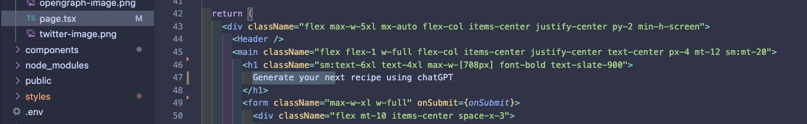
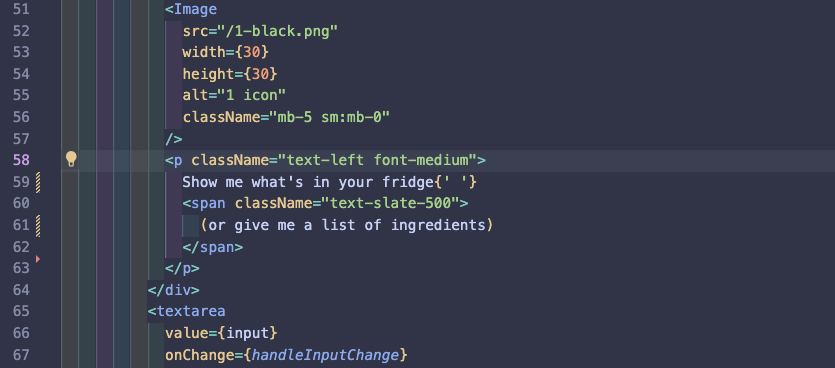

# Coding Instructions (Post-Event)

## Part 4. Add Your OpenAI API Key

Now that you've signed up for an OpenAI key, created a GitHub account, and deployed your AI-powered application on Vercel -- you're ready to start customizing your application! Let's make a recipe app out of a Twitter bio app!

In order to safely add your OpenAI API key to your code repository, we recommend that you download the repository locally, and work with the files in your local development server.

__NOTE:__ Do not add your OpenAI API key to GitHub, as your key can be stolen by others, who can run up a charge.

If you already have your local development environment set up, with Node.js and Git installed, and a code editor like VS Code, you can move on to the next steps below. Otherwise, please refer to these [Local Environment Setup Instructions](./localsetup.md)

-------

To add your OpenAI API key to your code repository, navigate to the `.env.example` file in your Next.js repository. Change the name of this file from `.env.example` to `.env`.

Add your API key here by assigning it to this variable:

```
OPENAI_API_KEY=
```

Voila! Now if you run this site locally, you should be able to make calls to the OpenAI API, and generate Twitter bios.

## Part 5. Modifying Page.tsx

Now, navigate to `app/page.tsx` in your Next.js folder structure. This is where the code that holds the [View](https://www.geeksforgeeks.org/mvc-design-pattern/) of your application is located.

Use "Ctrl + F" (or 'Cmd + F') to find the words "Generate your next Twitter bio using ChatGPT" on the page. Change this text to "Generate your next recipe using OpenAI".



Next, find and change the text for the input form from: "Copy your current bio (or write a few sentences about yourself)" to something like this:



Further below on the page, where it says "Generate your bio" and "Your generated bios," change the text to "Generate your recipe" and "Your generated recipes."

## Part 6. Modifying the DropDown.tsx Component
