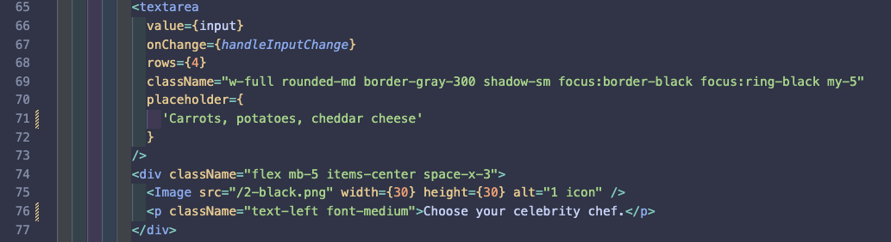
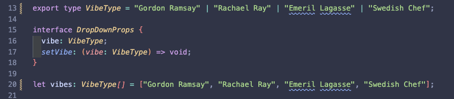
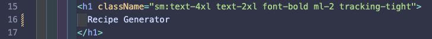
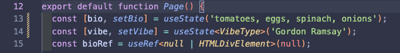
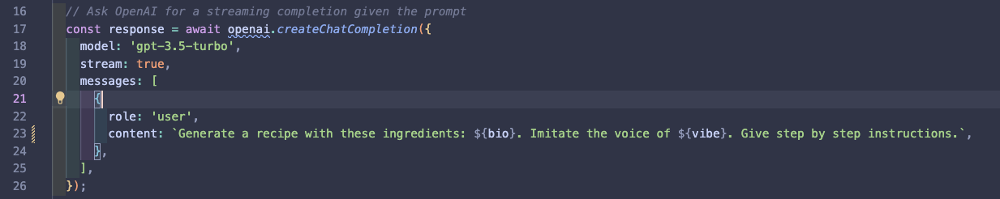
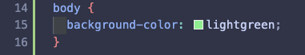

# Coding Instructions (Post-Event)

## Part 4. Add Your OpenAI API Key

Now that you've signed up for an OpenAI key, created a GitHub account, and deployed your AI-powered application on Vercel -- you're ready to start customizing your application! Let's make a recipe app out of a Twitter bio app!

In order to safely add your OpenAI API key to your code repository, we recommend that you download the repository locally, and work with the files in your local development server.

__NOTE:__ Do not add your OpenAI API key to GitHub, as your key can be stolen by others, who can run up a charge.

If you already have your local development environment set up, with Node.js and Git installed, and a code editor like VS Code, you can move on to the next steps below. Otherwise, please refer to these [Local Environment Setup Instructions](./localsetup.md)

-------

To add your OpenAI API key to your code repository, navigate to the `.env.example` file in your Next.js repository. Change the name of this file from `.env.example` to `.env`.

Add your API key here by assigning it to this variable:

```
OPENAI_API_KEY=
```

Voila! Now if you run this site locally, you should be able to make calls to the OpenAI API, and generate Twitter bios.

## Part 5. Modify Page.tsx

Now, navigate to `app/page.tsx` in your Next.js folder structure. This is where the code that holds the [View](https://www.geeksforgeeks.org/mvc-design-pattern/) of your application is located.

Use "Ctrl + F" (or 'Cmd + F') to find the words "Generate your next Twitter bio using ChatGPT" on the page. Change this text to "Generate your next recipe using OpenAI".


Next, find and change the text for the input form from: "Copy your current bio (or write a few sentences about yourself)" to something like this:


Also, change the text above the dropdown to "Choose your celebrity chef", and modify the placeholder text inside of the input field to include some default ingredients, like this:




Further below on the page, where it says "Generate your bio" and "Your generated bios," change the text to "Generate your recipe" and "Your generated recipes."

## Part 6. Modify the DropDown.tsx Component

Navigate to the `components/DropDown.tsx` file inside of your application directory.

Replace the VibeTypes with the names of your favorite chefs:




## Part 7. Modify the Header.tsx Component

Navigate to the `components/Header.tsx` file inside of your application.

Change the h1 header from "twitterbio.io" to a new name for your application, like this:




## Part 8. Modify Default Text in Page.tsx

Go back to `app/pages.tsx` and set the default Vibe (chef) to the name of your favorite chef, something like this:




## Part 9. Modify the Prompt in Route.tsx

Now that we're done modifying the template, we can move on to modify the prompt in `app/api/route.ts`

You can change the existing prompt to something like this:



After you save, you should now be able to use your form to submit ingredients to the OpenAI API, and have it return a step-by-step recipe in the voice of your favorite chef!

## Part 10. Styling Your App

Now let's spice up our app a bit, and give it some custom styling to match the theme of our new prompt.

Go to `/styles/globals.css` and change the background color of your application with just a tiny bit of CSS code, like this:



Better yet, you can use a nice background image like [this one](https://img.freepik.com/free-photo/fresh-colourful-ingredients-mexican-cuisine_23-2148254294.jpg?w=1800&t=st=1694986481~exp=1694987081~hmac=d63a0602c22d21d802aa1639bb58d1e4866fa36943ff123d7928dfb13d04f57d) by adding the following CSS properties:

```CSS
body {
  background-image: url('https://img.freepik.com/free-photo/fresh-colourful-ingredients-mexican-cuisine_23-2148254294.jpg?w=1800&t=st=1694986481~exp=1694987081~hmac=d63a0602c22d21d802aa1639bb58d1e4866fa36943ff123d7928dfb13d04f57d');
  background-size: cover;
}
```

Bam! (or should we say "Bork! Bork! Borked!?")


### Part 11. Debugging Your App

Now your app looks almost ready! Except, the returned prompt is a little bit weird! Why is the formatting a little bit borked? Why does the first part of your output get messed up?

Try figuring this out by asking ChatGPT. Can you debug the following issues?

1. Why does the generatedBios output get cut off and only show a spliced second half?

2. Why does the text fall outside of the boundaries of the box? How can you fix that?

3. Why is there an apparent off-by-one error in the output response, i.e. you always get the response that lags by one submission?


Try to figure out these puzzles yourself. If you get stuck and need the solution, you can refer to my solutions [here](./solutions/)

I'll provide an explanation for how to solve these bugs, as well as an explanation of how the Vercel AI library for chatbots works, in a following post!
