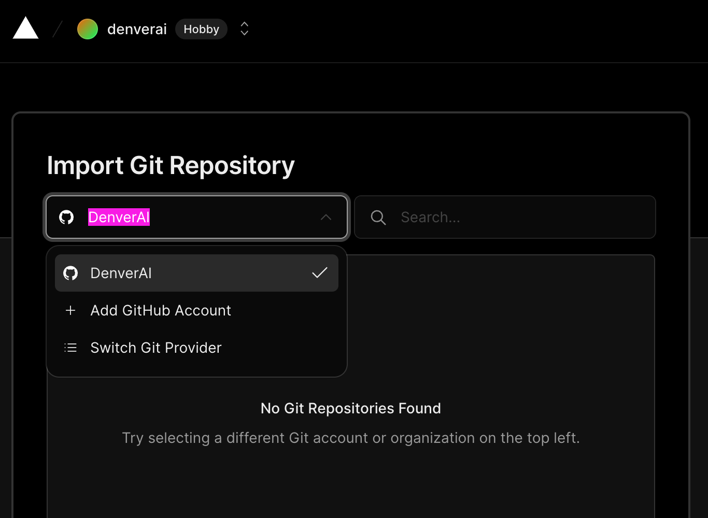
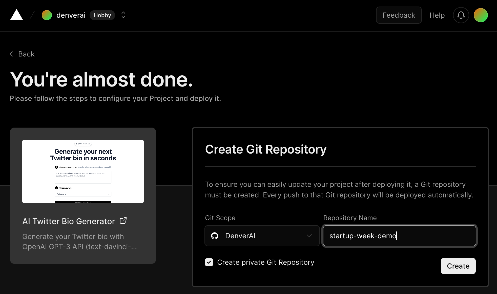
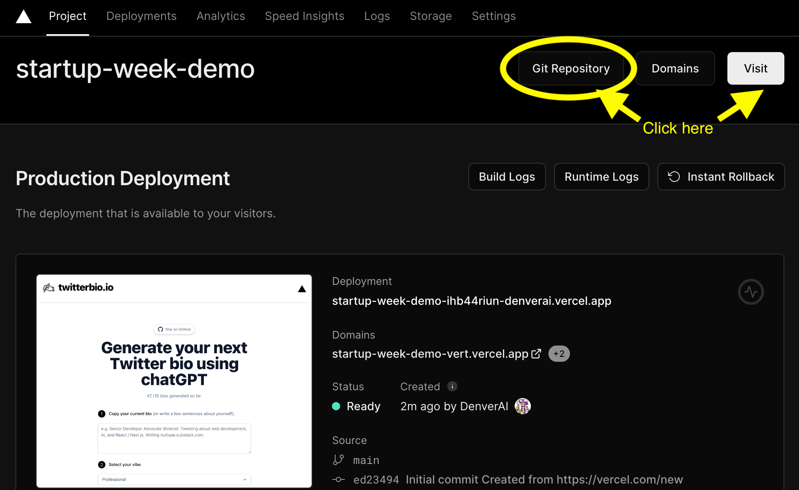
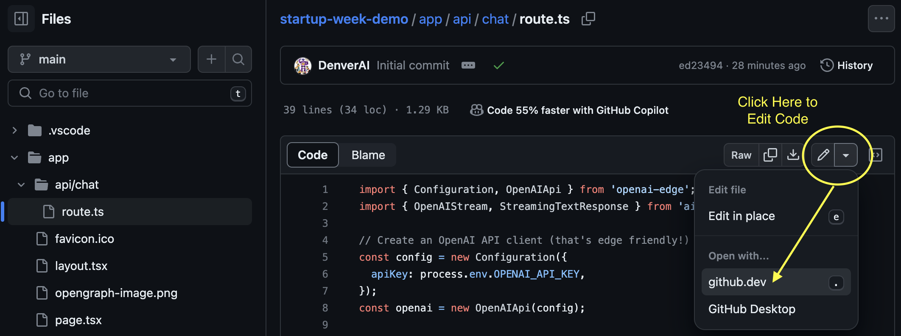

# Instructions

## Part 1. Setup

1. Sign up for a free account on [GitHub.com](https://github.com/signup) if you do not yet have one.
    * GitHub is like a public workspace for software engineers to save different versions of their code, and share / collaborate with others.
 

2. Sign up for a free Hobby account on [Vercel.com](https://vercel.com/signup) if you do not yet have one, and link this to your GitHub account.
    * Vercel is a cloud hosting platform that helps software engineers showcase their applications, display efficiently to global users, while automatically updating any changes to code in GitHub.
    * Vercel has built-in support for [Next.js](https://www.nextjs.org/docs), the full stack web development framework we are using.
    * Once you've created your account, in your [Vercel Dashboard](https://vercel.com/new), import your git repositories by clicking on "Import." Under Importing Git Repository, select "Add Github Account." This will open up a new "Install Vercel" window in Github.com. Click on the green "Install" button to link your Github account to Vercel.
 

 

3. Sign up for an account on [OpenAI](https://platform.openai.com/signup?launch). Create an API key for your account [here](https://platform.openai.com/account/api-keys). All new users get free $5 worth of tokens to use the OpenAI API. This is more than sufficient for powering our project.
 

4. Download the appropriate version of this code editor, [Visual Studio Code](https://code.visualstudio.com/download), for your operating system: Windows, Mac or Linux.

 

## Part 2. Deploy the Vercel AI Template

5. Take a look at the following [AI app templates and examples at Vercel](https://vercel.com/templates/ai). All of these are free for you to modify and use, with one-click deployment on Vercel.
    * Scroll down to the [AI Twitter Bio Generator](https://vercel.com/templates/next.js/twitter-bio) by open source software contributor Hassan el Mghari.
    * Click on the white [Deploy](https://vercel.com/new/clone?demo-description=Generate%20your%20Twitter%20bio%20with%20OpenAI%20GPT-3%20API%20(text-davinci-003)%20and%20Vercel%20Edge%20Functions%20with%20streaming.&demo-image=%2F%2Fimages.ctfassets.net%2Fe5382hct74si%2F2I7NoGPw25Em00dQYxMdJg%2Fba571bc9c9334611ebe4c67973029c26%2Fscreenshot.png&demo-title=AI%20Twitter%20Bio%20Generator&demo-url=https%3A%2F%2Fwww.twitterbio.io&env=OPENAI_API_KEY&envDescription=Get%20your%20API%20key%20from%20Openai.com&envLink=https%3A%2F%2Fbeta.openai.com%2Faccount%2Fapi-keys&from=templates&project-name=AI%20Twitter%20Bio%20Generator&repository-name=twitter-bio&repository-url=https%3A%2F%2Fgithub.com%2FNutlope%2Ftwitterbio&skippable-integrations=1) button.
    * You'll see a page that says "You're almost done." In the box on the right, under the heading "Create Git Repository", select your GitHub username and name this repository "startup-week-demo".

 

6. You will be asked to "Configure Project" with your OpenAI_API_Key.

For now, just type in the following string in the input box called "Value (Will Be Encrypted)`"temporarystring123"`, and click on the "Deploy" button
* NOTE: You can type in any random string you wish. Your actual key will be entered later into the '.env' file in your repository.
* The deployment process will take a little time to run. No worries! Vercel handles most of the difficult parts for you, so this part is a little like magic.

 

7. When you're done with deployment, you'll see a page that says "Congratulations! You just deployed a new Project to Vercel." Click on the button to "Continue to Dashboard."

 

8. In your Project Dashboard, you will see the name of the project, and three buttons to the right of the name:
    * The "Git Repository" button will lead you to where your code is stored on GitHub.
    * The "Visit" button will lead you to where your application is currently deployed onto the cloud for everyone in the world to see.
    * Click on the "Git Repository" button to open up your code repository in GitHub. Also "Visit" your new application!

 

## Part 3. Edit the Code on GitHub
If you are familiar with using cloning your Github repository and editing your code locally with VSCode, and if you already have your local development environment set up for NodeJS, then please go through the following steps in your local computer.

Otherwise, for the sake of simplicity, we will make the following edits directly inside of GitHub using the built-in "Github.dev" editor. See example below:

 

 
